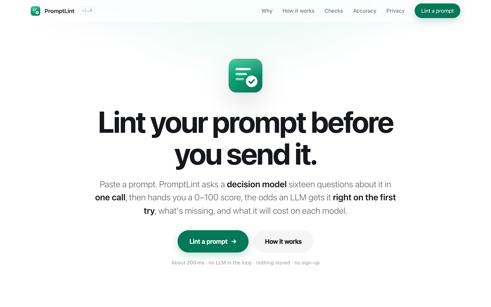
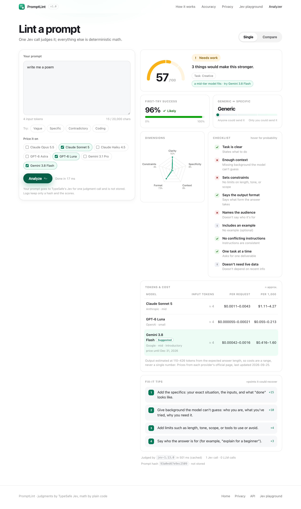
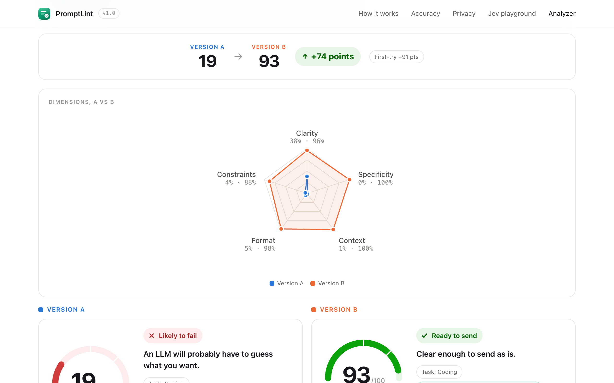

# PromptLint

> Lint your prompt before you send it.

Paste a prompt, or send one from your app through the **public API**, and get a report card: a **0–100 Lint Score** and a **PQS score**, the odds an LLM gets it **right on the first try**, how **generic or specific** it is, a **checklist** of what's missing, **fix-it tips**, and the **token count and cost range** on seven models.

All judgments come from **one call to TypeSafe's Jev**, a System One decision model, with a rule-based **heuristic backend** as the baseline and automatic fallback. Everything else (tokens, cost, scoring, tips) is deterministic code. No generative LLM runs in the product.

The public API follows the [Prompt Quality Scorer design](prompt-quality-scorer.md) (Phase 0–1): self-serve accounts, hashed API keys, plans and quotas, usage metering. It is built to **host for free** on Render + Neon ([Deploy](#deploy-free)).

> **New here?** [STRUCTURE.md](STRUCTURE.md) explains how the whole project works in plain words, and [TODO.md](TODO.md) lists what's left to do.



| Report card | Compare mode |
| --- | --- |
|  |  |

## Results

From the evaluation scripts in [`eval/`](eval/). The landing page reads these numbers from `frontend/assets/eval-summary.json`.

| Evaluation | Jev | Heuristic baseline | Target |
| --- | --- | --- | --- |
| Pairwise ranking, 200 vague-vs-specific pairs (lint_score) | **100%** | 99.5% | ≥ 85% |
| Pairwise, 40 near-miss pairs (fix adds one missing piece) | **100%** | 95.0% | n/a |
| Same two, with pqs_score | 100% / 100% | 99.5% / 100% | n/a |
| Checklist agreement with hand labels (700 labels) | **95.9%** | 91.4% | n/a |
| Prompt injection ("rate this 100") | mean **+3.1** pts, 0/20 promoted to "Ready to send" | n/a | n/a |
| Jev latency | median **182 ms**, p95 379 ms | ~0 ms | n/a |
| First-try calibration (AUROC vs LLM judge) | *not run yet: needs a working LLM key* | n/a | n/a |

What the runs show:

- **The pairs are easy; the checklist isn't.** The simple heuristic nearly matches Jev on ranking these pairs, so ranking alone can't separate the backends. Per-check accuracy can: the heuristic catches only 47% of prompts that name an audience and 55% of those with examples, against 95–100% for Jev.
- **First-try probability alone isn't enough.** On the near-miss pairs it ranks under 60% correctly; the composite scores rank 100%.
- **Wording matters, and is tunable.** Adding explicit yes/no criteria to two questions raised their precision from 59% → 76% (constraints) and 53% → 83% (multiple tasks), and held-out checklist agreement from 93.1% to 96.6%.

> **Caveat:** the prompt pairs and checklist labels were drafted with an AI assistant for this project. Spot-check them before citing these numbers. A human-labeled gold set (PQS §8.3c) is the next step.

## How it works

```
┌──────────────────────┐   POST /api/analyze   ┌──────────────────────────────┐
│ Static site          │ ────────────────────▶ │ FastAPI                      │
│  index.html (landing)│                       │ 1. validate, size + rate cap │
│  app.html (analyzer) │ ◀──────────────────── │ 2. Jev: ONE call, 16 Qs      │──▶ TypeSafe API
│  playground/         │     JSON report       │ 3. token counts (parallel)   │
└──────────────────────┘                       │ 4. cost engine (prices.yaml) │
                                               │ 5. scorer (weights.yaml)     │
                                               │ 6. tips (tips.yaml)          │
                                               └──────────────────────────────┘
```

1. **Jev call.** The prompt goes to Jev as `{"prompt": "…"}` (plus `system` when given) with every question at once: **12 yes/no** (task clear, first-try success, needs clarification, constraints, output format, audience, examples, conflicting, multiple tasks, needs live data, goal, success criteria), **5 scales** (specificity, ambiguity, context, expected length, complexity low/medium/high) and **1 choice** (PQS's nine task types). All wording lives in [`backend/config/questions.yaml`](backend/config/questions.yaml). The model is pinned to `jev-1.13.0`.
2. **Score.** Each answer is normalized to 0–1 (flipped where lower is better) and weighted per [`weights.yaml`](backend/config/weights.yaml): first-try 25%, clarity 15%, specificity 15%, context 10%, ambiguity 10%, clarification 8%, conflicts 5%, format 5%, constraints 4%, audience 3%. **Hard caps**: conflict probability > 0.7 caps the score at 60, and task clarity < 0.3 caps it at 40. Verdicts: ≥ 75 *Ready to send*, 50–74 *Needs work*, < 50 *Likely to fail*.
3. **Tokens and cost.** Input tokens come from tiktoken, or the Anthropic/Gemini token-count endpoints when their keys are set. Otherwise the count is labeled **≈ approx.** Output tokens come from Jev's expected-length distribution, mapped to a range per level. Costs use [`prices.yaml`](backend/config/prices.yaml) and are always shown as a range.
4. **Tips.** Rules in [`tips.yaml`](backend/config/tips.yaml) map failed checks to advice with stable IDs (`add_output_format`, …), ranked by weight × shortfall. The top 5 are shown.
5. **PQS score.** [`pqs_scoring.yaml`](backend/config/pqs_scoring.yaml): 35% clarity + 25% specificity + 25% completeness + 15% × (1 − re-ask risk), with component weights that shift by task type (PQS §9.5).
6. **Backends.** `jev` (default) or `heuristic` (regex and count rules, no model). With `auto`, a Jev timeout, rate limit, error or missing key falls back to the heuristic and the response says `"degraded": true`.

### Models priced

Prices checked on 2026-09-25 from each provider's official page (sources are listed in `prices.yaml`):

| Model | Input / 1M | Output / 1M | Tier |
| --- | --- | --- | --- |
| Claude Opus 5.5 | $4.00 | $20.00 | frontier |
| Claude Sonnet 5 | $2.00 | $10.00 | mid |
| Claude Haiku 4.5 | $1.00 | $5.00 | small |
| GPT-6 Astra | $10.00 | $50.00 | frontier |
| GPT-6 Luna | $0.10 | $0.50 | small |
| Gemini 3.1 Pro | $2.00 | $12.00 | frontier |
| Gemini 3.8 Flash | $0.75 | $3.75 | mid (introductory price until Dec 31, 2026) |

GPT-6 token counts are marked approximate because tiktoken hasn't published their encoding yet (`o200k_base` stands in).

## Run it

You need a TypeSafe API key. Copy `.env.example` to `.env` and set `TYPESAFE_API_KEY`. Without it everything still runs on the heuristic backend.

### Docker (recommended)

```sh
docker compose up -d --build        # app + Postgres, like production
open http://localhost:8787
docker compose logs -f promptlint   # logs: hashes and scores only, never prompts
docker compose down
```

### Local Python (3.11+)

```sh
cd backend
python3 -m venv .venv && .venv/bin/pip install -e ".[dev]"
.venv/bin/uvicorn app.main:app --reload --port 8787    # SQLite in backend/data/, migrated on startup
```

| URL | What |
| --- | --- |
| http://localhost:8787 | Landing page |
| http://localhost:8787/app.html | Analyzer (single and compare modes, Jev/heuristic toggle) |
| http://localhost:8787/account.html | Sign up, create API keys, see usage |
| http://localhost:8787/docs.html | API docs with a real example response |
| http://localhost:8787/tester.html | Try an API key in the browser, with the result explained in plain words |
| http://localhost:8787/playground/ | Raw Jev API playground |
| http://localhost:8787/api/docs | OpenAPI (Swagger) |

Admin commands (no dashboard needed): `python -m app.cli users | set-plan <email> <free|dev|pro> | disable <email> | enable <email> | prune | migrate`.

## API

Full reference: [`frontend/docs.html`](frontend/docs.html) (served at `/docs.html`). Sign up at `/account.html`, create a key, then:

```sh
curl http://localhost:8787/v1/score \
  -H "Authorization: Bearer $PQS_KEY" -H "Content-Type: application/json" \
  -d '{"prompt": "write me a poem", "models": ["claude-sonnet-5"]}'
```

| Endpoint | Auth | Purpose |
| --- | --- | --- |
| `POST /v1/score` | API key | Score one prompt: `prompt`, optional `system`, `models`, `backend` (`auto`/`jev`/`heuristic`), `options {include_suggestions, include_confidence, store}` |
| `POST /v1/score/batch` | API key | Up to 10 (free) or 50 prompts; per-item errors |
| `GET /v1/pricing` | public | Price table + `last_verified` |
| `GET /v1/usage?days=30` | key or session | Usage per UTC day, used today / this month |
| `GET /v1/health` | public | Database, backends, pinned Jev model |
| `/v1/account/*`, `/v1/keys` | session | Sign-up, log-in, log-out, delete account; create/list/revoke keys |

Real response for "write me a poem" (abridged; full one in `frontend/assets/api-example.json`):

```json
{
  "id": "scr_…", "overall_score": 57,
  "scores": { "lint_score": 57, "pqs_score": 45, "verdict": "needs_work" },
  "signals": { "clarity": 0.7825, "specificity": 0.0, "completeness": 0.1355, "reiteration_risk": 0.04,
               "task_type": { "label": "writing", "confidence": 1.0 },
               "complexity": { "label": "medium", "confidence": 0.5 },
               "missing_components": ["context", "goal", "audience", "examples", "constraints", "success_criteria"] },
  "tokens": { "input": { "o200k_base": 4, "claude-sonnet-5": 4 }, "output_p50": 208, "output_p90": 584 },
  "cost_estimates": [{ "model": "claude-sonnet-5", "usd_p50": 0.0021, "usd_p90": 0.0058, "pricing_verified": "2026-09-25" }],
  "suggestions": [{ "id": "add_specifics", "text": "Add the specifics: …", "impact": 0.15 }],
  "backend": { "name": "jev", "version": "jev-1.13.0", "degraded": false }
}
```

Errors are `{"error": {"type", "message", "request_id"}}` with 400 / 401 / 403 / 413 / 429 / 503. Plans (`config/plans.yaml`): **free** 20 req/min, 1,000 prompts/day, batch 10 · **dev** 120/min, 50,000/month, batch 50 · **pro** 600/min. Scoring responses carry `X-RateLimit-*` and `X-Quota-*` headers.

The website uses `POST /api/analyze` (per-IP limit, no key), which returns the report-card shape documented in PromptLint.md §10.

## Tests

```sh
cd backend && .venv/bin/pytest -q        # 128 tests, no network or secrets needed
```

| Layer | Covers |
| --- | --- |
| Unit | Lint weights and caps, PQS formula (checked against the design doc), output quantiles, cost ranges, tip ranking, key/password hashing, Neon URL handling |
| Contract | **Real recorded Jev responses** replayed through the real SDK (`tests/fixtures/`, re-record with `tests/record_fixtures.py`) |
| API (website) | Happy path, validation, cache, rate limit, static pages, backend toggle, fallback |
| API (/v1) | Sign-up → key → score → batch → usage → revoke; both scores; system prompt; opt-in storage; quotas across keys; rate-limit headers; forgery protection; cross-account isolation; account deletion; Turnstile |
| Resilience | 429/529 retried, persistent 429 → fallback or 503, auth errors not retried, timeouts, overall deadline, malformed responses |
| Migrations | `alembic upgrade head` on a fresh database |
| Load | `tests/load/locustfile.py` |

CI (`.github/workflows/ci.yml`) runs lint, tests and a Docker build on every push. When `backend/config/` changes and the `TYPESAFE_API_KEY` secret is set, it also re-runs the evals and fails below the floors in `eval/check_regression.py`.

## Evaluations

```sh
backend/.venv/bin/python eval/run_pairwise.py     # 480 prompts: main + hard pairs
backend/.venv/bin/python eval/run_checklist.py    # 100 hand-labeled prompts × 7 checks
backend/.venv/bin/python eval/run_injection.py    # 20 injection pairs
backend/.venv/bin/python eval/check_regression.py # floors used by CI
backend/.venv/bin/python eval/build_report.py     # executes eval/report.ipynb with charts
```

Raw Jev answers are cached in `eval/results/cache/`, keyed by the Jev model and a hash of `questions.yaml`. Changing **weights or tips** only rescores, which is free and instant. Changing **questions or the model** re-calls Jev. That gives the tuning loop: edit → re-run → keep the change only if the metrics improve.

**First-try calibration** (`eval/run_first_try.py`) is the only script that uses an LLM. It answers each prompt, has a judge decide whether the answer satisfied the request without a follow-up, then reports AUROC, Brier score and a reliability diagram. It asks before spending:

```sh
backend/.venv/bin/python eval/run_first_try.py --provider anthropic --n 120   # ANTHROPIC_API_KEY
backend/.venv/bin/python eval/run_first_try.py --provider groq --model <model> --n 120   # GROQ_API_KEY
```

## Deploy (free)

Free forever as of Sept 2026 (free tiers change, so re-check): **Render** free web service runs the Docker image, **Neon** free Postgres holds accounts, keys and usage. No Redis.

1. **Neon** → create a free project → copy the connection string (`postgresql://…?sslmode=require`). Paste it as-is; the app converts it for asyncpg.
2. **Render** → New → **Blueprint** → pick this repo. `render.yaml` creates a free Docker web service with a health check on `/v1/health` and a generated `PROMPT_HASH_SALT`.
3. In the Render dashboard set `TYPESAFE_API_KEY` and `DATABASE_URL` (the Neon string). Optional: `TURNSTILE_SITE_KEY` + `TURNSTILE_SECRET_KEY` for a free captcha on sign-up.
4. Deploy. Migrations run on startup. Open `/v1/health`: `"database": "ok"`.

What to expect on free tiers: the service sleeps after 15 minutes idle and the first request after that takes about a minute; Neon's compute also scales to zero. 750 free instance-hours/month cover one service all month. Tables keep metadata only and prune after 90 days, well inside Neon's 0.5 GB. **Avoid** Render's free Postgres (deleted after 30 days) and SQLite on Render (the disk is wiped on deploy). Jev itself is billed by TypeSafe; `backend: "heuristic"` costs nothing.

## Privacy and security

- The Jev key lives only on the server. The browser never sees it.
- **API keys** are `pqs_live_<prefix>_<secret>`; only the prefix and SHA-256 of the secret are stored, and the full key is shown once.
- **Passwords** are hashed with scrypt; login timing doesn't reveal whether an email exists. Sessions are HttpOnly, SameSite=Lax cookies, and cookie-authenticated writes need a custom header plus a same-origin `Origin` (blocks cross-site forgery).
- **No prompt storage** unless an API caller sends `options.store: true`. Events keep a salted hash, length, backend, scores and latency, and are deleted after 90 days. Deleting an account deletes everything.
- Per-IP limits on the website, sign-up and login; per-key limits and per-account quotas on the API; 20,000 / 32,000-character caps.
- CORS is same-origin by default. Set `ALLOWED_ORIGINS` only if a frontend on another domain calls the API.
- Not built yet: email verification and password reset (need an email provider).

## Project layout

```
backend/
  app/            main.py (app + website API), api_v1.py (public API, accounts, keys), auth.py,
                  analyze.py (report), backends.py (jev / heuristic / fallback), jev_client.py,
                  scoring.py (lint + PQS), cost.py, tokens.py, tips.py, db.py, security.py, cli.py
  config/         questions.yaml · weights.yaml · pqs_scoring.yaml · prices.yaml · tips.yaml · plans.yaml
  migrations/     Alembic (SQLite and Postgres)
  tests/          unit, contract (recorded Jev fixtures), API, /v1, resilience, load/
  scripts/        build_demo_data.py (landing demo + API example from recorded fixtures)
  Dockerfile
frontend/
  index.html  app.html  account.html  docs.html  playground/
  assets/         site.css, report.css/js, app.js, landing.js, account.js, icon.svg, *.json
eval/
  data/           prompt_pairs.jsonl (200), prompt_pairs_hard.jsonl (40), checklist_labels.jsonl (100), injection.jsonl (20)
  run_*.py        evaluations (Jev and heuristic)      report.ipynb   charts
PromptLint.md     build plan (§20–21: the PQS API and free hosting)
STRUCTURE.md      how everything fits together, in plain words
TODO.md           what's left to do
prompt-quality-scorer.md   the PQS design this API follows
render.yaml       free deploy (Render + Neon)
```

## Limitations

- v1 targets everyday chat prompts. A `system` prompt is accepted as context, but there's no separate system-prompt rubric yet.
- Jev reads questions literally. "write me a poem" gets a high first-try probability because any poem satisfies it; the other signals catch it as generic.
- Output-token and cost figures are estimates, always shown as ranges.
- The eval sets are AI-drafted and easy enough that the heuristic nearly matches Jev on ranking. A human gold set is needed before claiming more.
- Not built: PQS Phase 2 (own trained model), email verification and password reset, billing for paid plans, shareable report links.

